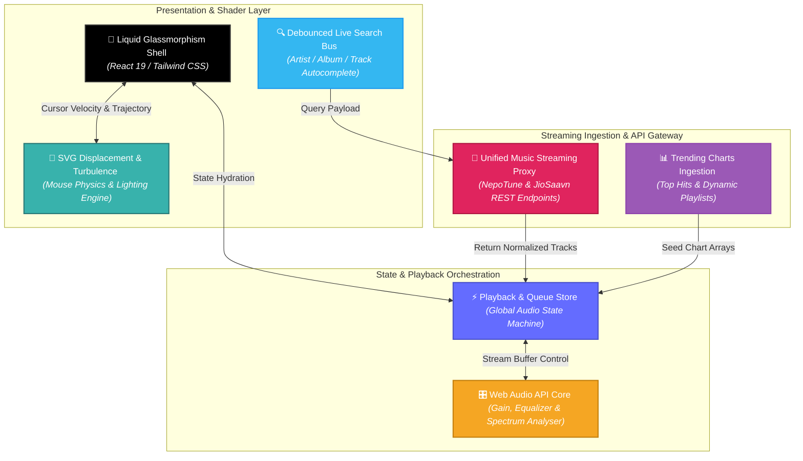

# 🎵 Harmonia — Glassmorphic Music Player

### High-Fidelity 320kbps Audio Streaming Engine, Real-Time Audio Proxy & Physics-Driven Liquid Glassmorphism Interface

**Harmonia** is a modern, high-fidelity music streaming platform engineered with React 19, Next.js, TypeScript, and Tailwind CSS. Designed to deliver an immersive audiovisual experience, Harmonia combines low-latency 320kbps playback streams via unified API proxies (NepoTune and JioSaavn endpoints) with an interactive SVG displacement and turbulence distortion pipeline that dynamically reacts to mouse physics and viewport movements.

<p align="center">
  
  
  
  
  
  
</p>

<p align="center">
  <a href="https://github.com/shreeharsh-patil/MusicBox/stargazers"></a>
  <a href="https://github.com/shreeharsh-patil/MusicBox/issues"></a>
  <a href="LICENSE"></a>
</p>

---

## 🏛️ System Architecture & Visual Distortion Pipeline

Media applications often face performance degradation when layering complex visual filters over active high-bitrate media playback streams.

**Harmonia** addresses this with a **GPU-Accelerated SVG Filter Bus**. High-bitrate 320kbps audio buffers stream asynchronously via HTML5 Audio and Web Audio API pipelines, while user cursor coordinates feed an isolated math kernel. This kernel drives SVG `feTurbulence` and `feDisplacementMap` filters via CSS transforms on composite layers, keeping frame rates at 60 FPS while streaming studio-grade audio.



> [!NOTE]
> **Zero-Config Secrets Decoupling**: Harmonia strictly abstracts provider origins, endpoints, and CORS proxy routing parameters through environment variables, preventing hardcoded third-party domain references in production client builds.

---

## 🔄 End-to-End Track Resolution & Streaming Lifecycle

The sequence blueprint below shows the complete lifecycle of a user search request, from query debouncing to provider resolution, metadata parsing, and continuous audio buffering:

```mermaid
sequenceDiagram
    autonumber
    actor User as Music Enthusiast
    participant UI as React 19 Frontend
    participant SRCH as Search Controller
    participant API as Streaming Provider API (JioSaavn/NepoTune)
    participant AUD as Web Audio Engine

    User->>UI: Input Track or Artist Query
    UI->>SRCH: Debounce Input Event (350ms delay)
    SRCH->>API: Dispatch GET Request with Sanitized Query
    API-->>SRCH: Return Normalized Search Match Collection
    SRCH-->>UI: Render Track Cards & Media Artwork

    User->>UI: Select Track & Click Play
    UI->>API: Request 320kbps Direct Audio Source Stream
    API-->>AUD: Pipe High-Bitrate Binary Stream (.mp4/.mp3)
    
    rect rgb(20, 30, 20)
        note over AUD,UI: Real-Time Playback & Physics Animation
        AUD->>AUD: Decode Audio Buffer & Connect Gain/Frequency Nodes
        AUD-->>UI: Feed Spectrum Telemetry to Visualizer
        UI-->>User: Output 320kbps Audio Stream & Animate Glass UI
    end
```



---

## 🛠️ Production Pipeline Implementation

| Pipeline Component | Technical Challenge | Enterprise Engineering Solution |
| :--- | :--- | :--- |
| **🌊 Liquid Glass Shaders** | Heavy graphic calculations for glassmorphism often cause UI stutter on low-power devices. | Uses hardware-accelerated SVG displacement filters (`feTurbulence`) applied via decoupled CSS render layers. |
| **⚡ Real-Time Search** | Rapid typing sends redundant network requests, leading to rate limits and out-of-order responses. | Integrates a 350ms debounced search controller with cancellation tokens to guarantee clean search results. |
| **🎵 320kbps Continuous Audio** | Stream buffer drops and codec changes interrupt playback across tracks. | Implements HTML5 Audio wrappers backed by Web Audio API buffer management for gapless audio playback. |
| **🛡️ Dynamic Provider Fallback** | Unannounced streaming endpoint changes cause playback errors and broken track streams. | Uses unified data normalization adapters across NepoTune and JioSaavn APIs with automatic fallback routing. |

---

## 🚀 Deployment & Local Initialization

### Prerequisites
- **Runtime Sandbox**: Node.js >= 18.x
- **Package Manager**: npm, pnpm, or yarn

### Step-by-Step Local Setup

1. **Repository Instantiation & Package Assembly**
   ```bash
   # Clone the repository
   git clone https://github.com/shreeharsh-patil/MusicBox.git
   cd MusicBox

   # Install project dependencies
   npm install
   ```

2. **Environment Variables Configuration**
   Copy `.env.example` to `.env` in the root folder:
   ```bash
   cp .env.example .env
   ```

   Populate `.env` with your API provider configurations:
   ```env
   # NepoTune & Music APIs
   NEPOTUNE_API_URL=https://nepotuneapi.vercel.app
   JIOSAAVN_API_URL=https://www.jiosaavn.com/api.php
   JIOSAAVN_DES_KEY=38346591
   JIOSAAVN_TRENDING_CHART_ID=110858205
   JIOSAAVN_SUPERHITS_CHART_ID=1134548194

   # Client Settings
   NEXT_PUBLIC_APP_NAME=Harmonia
   NEXT_PUBLIC_APP_URL=http://localhost:3000
   ```

3. **Launch Development Server**
   ```bash
   npm run dev
   ```
   Application runs live at: [http://localhost:3000](http://localhost:3000)

4. **Build for Production**
   ```bash
   # Run type checks and compile production bundle
   npm run build

   # Start production server
   npm run start
   ```

---

## 📁 Repository Directory Architecture

```
Harmonia/
├─ app/                             # Next.js App Router & Server Endpoints
│  ├─ api/                          # High-Performance API Gateway Routes
│  │  ├─ search/                    # Debounced Song & Artist Search Engine
│  │  ├─ stream/                    # Media Stream Proxy & CORS Resolver
│  │  ├─ trending/                  # Live Indian & Global Chart Ingestion
│  │  └─ lyrics/                    # Synchronized Lyrics Ingestion Engine
│  ├─ globals.css                   # Tailwind CSS v4 & Glassmorphism Rules
│  ├─ layout.tsx                    # Root Viewport Layout & Metadata Shell
│  └─ page.tsx                      # Dynamic Responsive Main Stage
├─ components/                      # Reusable Glassmorphism UI Primitives
│  └─ music-player-ui.tsx           # Liquid Glass Player, Audio Core & Mobile Tabs
├─ lib/                             # Core Services, Encryption & Audio Utilities
│  ├─ config.ts                     # Centralized Environment Configuration
│  ├─ des.ts                        # DES-ECB 320kbps Audio Stream Decryptor
│  ├─ jiosaavn.ts                   # JioSaavn API Normalization Adapter
│  ├─ nepotune.ts                   # NepoTune REST Service Adapter
│  └─ utils.ts                      # Class Merging & HTML Entity Decoders
├─ public/                          # Static Artwork, Backgrounds & Fallback Assets
├─ .env.example                     # Environment Configuration Template
├─ package.json                     # Dependencies, Scripts & Build Manifest
├─ tsconfig.json                    # TypeScript Compilation Rules
└─ README.md                        # Unified Platform Documentation
```

---

## ⚖️ Legal Guidelines & License

> [!WARNING]
> This software is distributed under the terms of the MIT License. It is an independent open-source project built for audio streaming research, UI/UX shader experiments, and software portfolio evaluations. Harmonia does not store or host copyrighted media files on its servers; audio streams are fetched dynamically via public third-party APIs.

---

## 👤 Project Author

Developed and Maintained by **Shreeharsh Patil**.

Feel free to contact me or submit issues via:
- **Email**: [shreeharsh.dev@gmail.com](mailto:shreeharsh.dev@gmail.com)
- **GitHub**: [github.com/shreeharsh-patil](https://github.com/shreeharsh-patil)
- **Repository**: [github.com/shreeharsh-patil/MusicBox](https://github.com/shreeharsh-patil/MusicBox)

